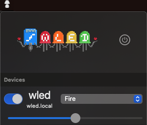

# WLED–OSX

An MacOS menu bar to control [WLED](https://github.com/Aircoookie/WLED).

## Features

- Power on / off controll
- Brightness controll
- Selection of defined presed
- Automatic device detection in local network

## Ideas / To Implement

- [ ] Set timer / sunrise …
- [ ] Open website for detailed configuration
- [ ] Open link to WLED-documentation
- [ ] Manage devices, store devices, rename devices
- [ ] Refresh devices 
- [ ] Improve button position

## Thanks

To [Christophe Gagnier](https://github.com/Moustachauve) ([WLED-Native-iOS](https://github.com/Moustachauve/WLED-Native-iOS)) for inspiration and showing how networking can be done for WLED in Swift.

